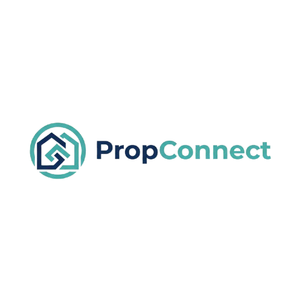

<div align="center">
  

  **Modern Property Management & Rental Platform**

  [](https://opensource.org/licenses/MIT)
  [](https://www.typescriptlang.org/)
  [](https://www.python.org/)
  [](https://reactjs.org/)
  [](https://flask.palletsprojects.com/)
</div>

---

## 📋 Table of Contents

- [Overview](#overview)
- [Features](#features)
- [Tech Stack](#tech-stack)
- [Project Structure](#project-structure)
- [Getting Started](#getting-started)
  - [Prerequisites](#prerequisites)
  - [Installation](#installation)
  - [Environment Variables](#environment-variables)
  - [Running the Application](#running-the-application)
- [Deployment](#deployment)
- [API Documentation](#api-documentation)
- [Contributing](#contributing)
- [License](#license)

---

## 🌟 Overview

**PropConnect** is a comprehensive property management and rental platform that seamlessly connects property owners (landlords) with potential tenants. Built with modern web technologies, it streamlines the entire rental process from property listing to lease management.

### What Makes PropConnect Different?

- 🏘️ **Dual Dashboard System** - Separate portals for landlords and tenants
- 🔍 **Advanced Search & Filters** - Find properties by location, price, type, and amenities
- 📍 **Interactive Maps** - Visual property search with map integration
- 💬 **Real-time Messaging** - Built-in communication between tenants and landlords
- 📄 **Digital Applications** - Streamlined rental application process
- 🔐 **Identity Verification** - Secure document upload and verification
- 🛠️ **Maintenance Tracking** - Request and track property maintenance
- 💰 **Payment Management** - Track rent payments and lease agreements
- 📊 **Analytics Dashboard** - Comprehensive insights for landlords
- 🏡 **Property Inspections** - Schedule and manage property viewings

---

## ✨ Features

### For Tenants
- ✅ Browse and search available properties
- ✅ Save favorite properties and get recommendations
- ✅ Submit rental applications with document upload
- ✅ Real-time messaging with property owners
- ✅ Track application status
- ✅ View lease agreements and payment history
- ✅ Submit maintenance requests
- ✅ Identity verification and background checks

### For Landlords
- ✅ List and manage multiple properties
- ✅ Upload property images and details
- ✅ Review and manage tenant applications
- ✅ Screen potential tenants
- ✅ Schedule property inspections
- ✅ Track maintenance requests
- ✅ Record rent payments
- ✅ Manage active leases
- ✅ View analytics and insights
- ✅ Communication hub for all properties

### For Admins
- ✅ Platform-wide oversight
- ✅ User management (tenants, landlords)
- ✅ Content moderation
- ✅ Analytics and reporting
- ✅ System configuration

---

## 🛠️ Tech Stack

### Frontend (`/client`)
- **Framework:** React 19.x + TypeScript
- **Build Tool:** Vite
- **Styling:** TailwindCSS + Mantine UI
- **State Management:** React Context API
- **Routing:** React Router v6
- **HTTP Client:** Axios
- **Maps:** Leaflet + React-Leaflet
- **Forms:** React Hook Form
- **Animations:** Framer Motion
- **Charts:** Chart.js + Recharts
- **Real-time:** Socket.IO Client
- **Authentication:** JWT with OAuth (Google)

### Backend (`/server`)
- **Framework:** Flask 3.x (Python)
- **Database:** PostgreSQL + SQLAlchemy ORM
- **Authentication:** Flask-JWT-Extended
- **Real-time:** Flask-SocketIO
- **Email:** Flask-Mail
- **File Storage:** Cloudinary
- **API Documentation:** Flask-Docs-API
- **Migrations:** Flask-Migrate (Alembic)
- **CORS:** Flask-CORS
- **Session Management:** Redis
- **Password Hashing:** bcrypt
- **Server:** Gunicorn + Uvicorn

---

## 📁 Project Structure

```
kedusoft/
├── client/                      # Frontend application
│   ├── public/                  # Static assets
│   │   └── images/
│   │       ├── brand/           # Logo and branding
│   │       └── houses/          # Property images
│   ├── src/
│   │   ├── apis/                # API integration layer
│   │   │   ├── axiosInstance.tsx
│   │   │   ├── authApi.tsx
│   │   │   ├── landlordApi.tsx
│   │   │   ├── tenantApi.tsx
│   │   │   ├── adminApi.tsx
│   │   │   ├── publicApi.tsx
│   │   │   └── messagingApi.tsx
│   │   ├── components/          # Reusable components
│   │   │   ├── shared/          # Shared components
│   │   │   ├── dashboard/       # Dashboard components
│   │   │   ├── modals/          # Modal dialogs
│   │   │   ├── messaging/       # Chat components
│   │   │   └── maps/            # Map components
│   │   ├── context/             # React Context providers
│   │   │   ├── UserContext.tsx
│   │   │   └── OnboardingContext.tsx
│   │   ├── hooks/               # Custom React hooks
│   │   ├── layouts/             # Page layouts
│   │   │   ├── AuthLayout.tsx
│   │   │   ├── DashboardLayout.tsx
│   │   │   ├── PublicLayout.tsx
│   │   │   └── OnboardingLayout.tsx
│   │   ├── pages/               # Page components
│   │   │   ├── Auth/
│   │   │   ├── Public/
│   │   │   ├── Dashboards/
│   │   │   ├── Onboarding/
│   │   │   └── Errors/
│   │   ├── routes/              # Route definitions
│   │   ├── services/            # Service layer
│   │   ├── types/               # TypeScript type definitions
│   │   └── utils/               # Utility functions
│   ├── package.json
│   └── vite.config.ts
│
├── server/                      # Backend application
│   ├── app/
│   │   ├── __init__.py         # App factory
│   │   ├── models/              # Database models
│   │   │   ├── user.py
│   │   │   ├── property.py
│   │   │   ├── application.py
│   │   │   ├── lease.py
│   │   │   ├── payment.py
│   │   │   ├── maintenance.py
│   │   │   └── message.py
│   │   ├── apis/                # API endpoints
│   │   │   ├── auth.py         # Authentication
│   │   │   ├── public.py       # Public endpoints
│   │   │   ├── tenant.py       # Tenant endpoints
│   │   │   ├── landlord.py     # Landlord endpoints
│   │   │   ├── admin.py        # Admin endpoints
│   │   │   ├── profile.py      # User profile
│   │   │   ├── messaging.py    # Real-time messaging
│   │   │   └── review.py       # Reviews & ratings
│   │   ├── utils/               # Utility functions
│   │   │   ├── helpers.py
│   │   │   ├── mailer.py
│   │   │   ├── variables.py
│   │   │   └── decorators.py
│   │   └── templates/           # Email templates
│   ├── migrations/              # Database migrations
│   ├── uploads/                 # Uploaded files
│   ├── requirements.txt
│   ├── run.py                   # Application entry point
│   └── .env.example
│
├── package.json                 # Monorepo root package
└── README.md                    # This file
```

---

## 🚀 Getting Started

### Prerequisites

Make sure you have the following installed:

- **Node.js** >= 18.x
- **Python** >= 3.11
- **PostgreSQL** >= 14.x
- **Redis** (for Socket.IO sessions)
- **Git**
- **npm** or **yarn**

### Installation

1. **Clone the repository**
   ```bash
   git clone https://github.com/ifeanyi-onyekwelu/kedusoft.git
   cd kedusoft
   ```

2. **Install all dependencies** (both client and server)
   ```bash
   npm run install:all
   ```

   Or manually:
   ```bash
   # Install root dependencies
   npm install

   # Install client dependencies
   cd client
   npm install
   cd ..

   # Install server dependencies
   cd server
   pip install -r requirements.txt
   cd ..
   ```

### Environment Variables

#### Client Environment Variables

Create `client/.env` file:
```env
VITE_API_BASE_URL=http://localhost:5000/api
VITE_GOOGLE_CLIENT_ID=your_google_client_id
VITE_SOCKET_URL=http://localhost:5000
```

#### Server Environment Variables

Create `server/.env` file (see `server/.env.example`):
```env
# APP VARIABLES
APP_SECRET=your_secret_key_here
APP_NAME=PropConnect
APP_URL=http://localhost:5173

JWT_SECRET=your_jwt_secret_here

# CLOUDINARY VARIABLES
CLOUD_NAME=your_cloudinary_name
CLOUD_API_KEY=your_cloudinary_api_key
CLOUD_API_SECRET=your_cloudinary_api_secret

# MAIL VARIABLES
MAIL_SERVER=smtp.gmail.com
MAIL_PORT=587
MAIL_USERNAME=your_email@gmail.com
MAIL_PASSWORD=your_app_password

# PostgreSQL Variables
POSTGRES_HOST=localhost
POSTGRES_PORT=5432
POSTGRES_USER=postgres
POSTGRES_PASSWORD=your_password
POSTGRES_DB=propconnect_db

GOOGLE_CLIENT_ID=your_google_client_id
```

### Database Setup

1. **Create PostgreSQL database**
   ```bash
   createdb propconnect_db
   ```

2. **Run migrations**
   ```bash
   cd server
   flask db upgrade
   ```

3. **Seed initial data** (optional)
   ```bash
   flask seed-categories
   ```

### Running the Application

#### Development Mode (Both Client & Server)

From the root directory:
```bash
npm run dev
```

This will start:
- **Frontend** at `http://localhost:5173`
- **Backend** at `http://localhost:5000`

#### Run Separately

**Frontend only:**
```bash
npm run dev:client
# or
cd client && npm run dev
```

**Backend only:**
```bash
npm run dev:server
# or
cd server && python run.py
```

---

## 🌐 Deployment

### Recommended Stack

**Free Tier (Development/Testing):**
- **Frontend:** Vercel (Free)
- **Backend:** Render Free Tier or Railway ($5/month)
- **Database:** Supabase (Free - 500MB)
- **File Storage:** Cloudinary (Free - 25GB bandwidth)
- **Domain:** Namecheap (~$10/year)

**Production Stack:**
- **Frontend:** Vercel Pro ($20/month)
- **Backend:** Railway Pro ($20/month)
- **Database:** Supabase Pro ($25/month)
- **File Storage:** Cloudinary or AWS S3
- **Email:** SendGrid ($15/month for 50k emails)

### Deployment Steps

#### Frontend (Vercel)

1. Connect your GitHub repository to Vercel
2. Set root directory to `client/`
3. Build command: `npm run build`
4. Output directory: `dist`
5. Add environment variables from `client/.env`

#### Backend (Railway/Render)

1. Connect your GitHub repository
2. Set root directory to `server/`
3. Build command: `pip install -r requirements.txt`
4. Start command: `gunicorn wsgi:app`
5. Add environment variables from `server/.env`

---

## 📚 API Documentation

The API is documented using Flask-Docs-API and can be accessed at:

```
http://localhost:5000/api/docs
```

### API Endpoints Overview

#### Authentication
- `POST /api/auth/register` - User registration
- `POST /api/auth/login` - User login
- `POST /api/auth/google` - Google OAuth login
- `POST /api/auth/verify-email` - Email verification
- `POST /api/auth/forgot-password` - Password reset request

#### Public
- `GET /api/public/properties` - List all properties
- `GET /api/public/properties/:id` - Get property details
- `GET /api/public/search` - Search properties
- `GET /api/public/categories` - Property categories

#### Tenant
- `GET /api/tenant/applications` - View applications
- `POST /api/tenant/applications` - Submit application
- `GET /api/tenant/recommendations` - Property recommendations
- `POST /api/tenant/favorites` - Save favorite property
- `POST /api/tenant/maintenance` - Submit maintenance request

#### Landlord
- `GET /api/landlord/properties` - List landlord properties
- `POST /api/landlord/properties` - Create new property
- `PUT /api/landlord/properties/:id` - Update property
- `GET /api/landlord/applications` - View applications
- `POST /api/landlord/applications/:id/approve` - Approve application
- `POST /api/landlord/inspections` - Schedule inspection
- `POST /api/landlord/payments` - Record payment

#### Messaging
- `GET /api/messages/conversations` - List conversations
- `POST /api/messages/send` - Send message
- `Socket.IO events` - Real-time messaging

---

## 🤝 Contributing

We welcome contributions! Please follow these steps:

1. Fork the repository
2. Create a feature branch (`git checkout -b feature/AmazingFeature`)
3. Commit your changes (`git commit -m 'Add some AmazingFeature'`)
4. Push to the branch (`git push origin feature/AmazingFeature`)
5. Open a Pull Request

### Development Guidelines

- Follow existing code style and conventions
- Write meaningful commit messages
- Add tests for new features
- Update documentation as needed
- Ensure all tests pass before submitting PR

---

## 📝 License

This project is licensed under the MIT License - see the [LICENSE](LICENSE) file for details.

---

## 👥 Team

- **Development Team** - [Ifeanyi Onyekwelu](https://github.com/ifeanyi-onyekwelu)

---

## 🙏 Acknowledgments

- Mantine UI for the excellent component library
- Leaflet for interactive maps
- Flask community for the robust backend framework
- All contributors and supporters

---

## 📞 Support

For support, email support@propconnect.com or join our community chat.

---

<div align="center">
  Made with ❤️ by the PropConnect Team

  ⭐ Star us on GitHub — it helps!
</div>
