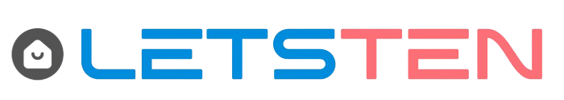

  

  **Letsten Mobile App**

  Flutter-based mobile application for the Letsten rental platform.

---

## 🌟 Overview

**Letsten Mobile** is the cross-platform mobile application for the Letsten rental system.
It allows tenants and landlords to manage properties, applications, and communication directly from their phones.

This app consumes the same REST API used by the web platform.

---

## ✨ Features

### Tenants
- Browse and search properties
- Save favorites
- Apply for rentals
- Upload documents
- Chat with landlords
- Track application status

### Landlords
- Manage property listings
- Review tenant applications
- Schedule inspections
- Track maintenance requests
- Messaging

---

## 🛠 Tech Stack

- **Framework:** Flutter (Dart)
- **State Management:** Provider / Riverpod / Bloc (pick one later)
- **HTTP Client:** Dio / http
- **Authentication:** JWT
- **Storage:** Secure Storage
- **Maps:** Google Maps / Mapbox
- **Real-time:** Socket.IO / WebSockets

---

## 📁 Project Structure

